# How to Play — Five Legends of Riftbound

A standalone, play-focused guide to five **Riftbound** legends — **Diana**, **Vi**,
**Azir**, **Lillia**, and **Leona**. Each entry is a complete "how to pilot this deck"
walkthrough: the game plan, the win condition, the power curve, the key cards, and
**two decision trees** — one for *your* turn (offense) and one for the *opponent's*
turn (defense) — that separate the correct line from the greedy-instinct trap.

## Contents

1. [Rules primer](#rules-primer-what-the-trees-assume) — the shared vocabulary every tree assumes
2. [How to read the decision trees](#how-to-read-the-decision-trees)
3. **Diana — Scorn of the Moon** *(Mind / Chaos — reactive spell-control / tempo)* → [jump](#diana--scorn-of-the-moon)
4. **Vi — Piltover Enforcer** *(Fury / Order — proactive beatdown / tempo-midrange)* → [jump](#vi--piltover-enforcer)
5. **Azir — Emperor of the Sands** *(Calm / Order — Equipment-gated Sand Soldier swarm)* → [jump](#azir--emperor-of-the-sands)
6. **Lillia — Bashful Bloom** *(Calm / Mind — [Temporary] Sprite tempo)* → [jump](#lillia--bashful-bloom)
7. **Leona — Radiant Dawn** *(Calm / Order — stun-control midrange / buff accrual)* → [jump](#leona--radiant-dawn)
8. [Web Resources & Sources](#web-resources--sources)

---

## How to read the decision trees

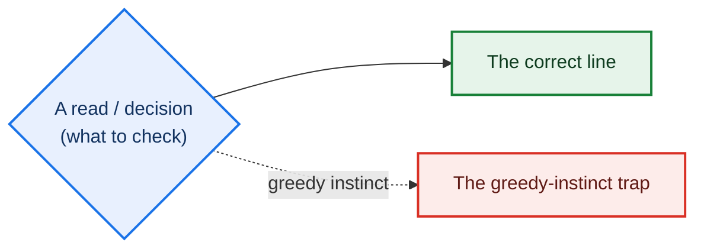

Blue = a read to make · Green = the correct line · Red (dashed) = the greedy trap.
Every legend below has **two** trees — one for your turn (offense), one for the
opponent's turn (defense) — because you make decisions on both.

> Riftbound units are written **Might + optional Power**, not "X/X". A "2-Might body"
> has 2 Might and no printed Power pip.

---

## Diana — Scorn of the Moon
*(Mind / Chaos — reactive spell-control / tempo)*

**Game plan.** Diana's legend — *"[Reaction] Exhaust: Add 1 Energy, spend only during
showdowns; this add can't be reacted to"* — is a resource nobody else has: interaction
invisible to the opponent's rune count and usable exactly when units are fighting over a
battlefield. So she plays a **tempo-control** game: contest early with cheap 2-Might
bodies (Ravenbloom Student, Tideturner), then win **the one showdown that matters** by
chaining cheap [Reaction] tricks part-funded by the showdown Energy — converting a
favourable fight into a Conquer, then Holding it to 8. Spell density does double duty:
every spell pumps **Ravenbloom Student +1 Might this turn**, so the "answers" are also
the clock.

**Win condition.** Bank a point on a contested showdown (shrink their attacker, bounce
their blocker, or pull-and-shrink defenders with Moonfall so your unit survives and
theirs doesn't), then **Hold** that battlefield toward 8. Vex - Apathetic locks a held
battlefield by stunning whatever the opponent plays there.

**Power curve.** Weakest turns 1–2 and vs. fast aggression (small bodies, and the Energy
only exists *inside* showdowns). Strongest mid-game (~T3–5) once Hwei is moving for
cards, Fizz is recurring spells, and Students are online. Favoured in the grind.

| Card | What it does |
|---|---|
| **Diana - Scorn of the Moon** (Legend) | Exhaust → **+1 Energy usable only in showdowns**, and the add **can't be reacted to**. Lets you cast one more trick than your visible runes imply — the bluff the deck is built around. |
| **Moonfall** (spell, 3 Energy + 1 Power) | Choose a battlefield where you have units; pull up to one enemy unit there; then **all** enemy units there get **−2 Might this turn**. Self-targets (no target prompt). |
| **Hwei - Brooding Painter** (Might 5) | *When I move:* draw 1, discard 1, then a bonus by discard type (spell→draw; gear→ready 2 runes; unit→+3 Might). The carry — move it every turn for value. |
| **Fizz - Trickster** (Might 3) | On play, replay a **≤3-Energy** spell from trash for free (still pay Power), then recycle it. Reuses Moonfall/Gust — the late-game gas. |
| **Vex - Apathetic** (Might 4, Deflect) | Stuns a unit the opponent plays onto its battlefield. The stun **auto-selects** the unit, so it isn't a "target" — targeting protection can't stop it. Locks a Hold. |
| **Ravenbloom Student** (Might 2) | *When you play a spell:* +1 Might this turn. Turns the reaction pile into an offensive clock. |
| **Gust / Stupefy / Star-Crossed / Smoke Screen** | The cheap [Reaction] toolbox. Gust bounces a unit with ≤3 Might; Star-Crossed bounces **one of yours + one enemy** (a real cost); Stupefy is −1 Might + draw; Smoke Screen is −4 Might. **Stupefy & Smoke Screen floor at 1 Might — they shrink, they don't kill.** |

> **Watch the fine print a greedy line ignores:** Diana adds **Energy only** —
> Moonfall / Star-Crossed / Smoke Screen still cost **Power**, so a "free" trick stack
> still drains runes; and the shrink spells can't take a unit below 1 Might.

### On your turn — *Is this THE showdown, and how deep do I commit?*

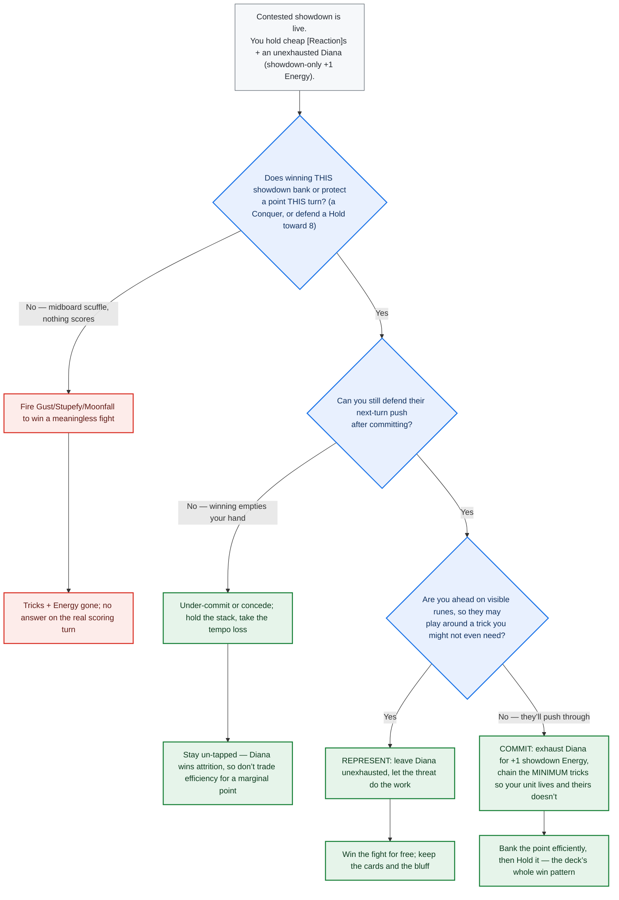

**Greedy vs. expert.** *Greedy:* exhausts Diana every fight (tipping the interaction) and
dumps tricks into scuffles that score nothing, then has no answer when a point is
actually on the line. *Expert:* represents the un-reactable Energy without spending it,
and empties the stack only on a Conquer/Hold-protecting showdown it can still defend
after.

### On the opponent's turn (defending) — *Shave the attack to a survivor, cheapest first*

Diana defends inside the showdown: her legend's **+1 Energy is un-reactable and exists
only in combat**, so she can answer with more than her visible runes show. She denies a
Conquer by keeping a defender alive — bounce or shrink attackers so one of her bodies
survives.

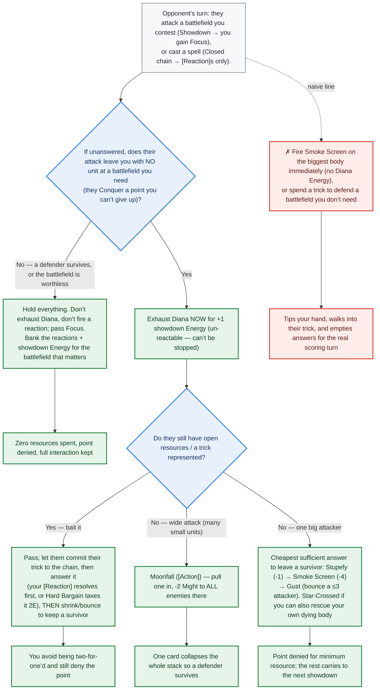

*(Note: Hard Bargain's [Repeat] raises the tax on the **same** spell to 4 Energy — it
doesn't counter a second spell. Vex - Apathetic, set up on your turn, is a standing
defensive lock: it Stuns any unit the opponent plays onto its battlefield.)*

**Sources.** [Diana champion deck guide — RQ Vancouver winner (riftboundguide.com, 2026-06-08)](https://riftboundguide.com/2026/06/08/riftbound-diana-champion-deck-guide/) ·
[Diana legend page — card text, tier, tournament results (Hextech Analytics)](https://hextechanalytics.com/legends/diana) ·
[Diana tempo / counter matchup (RiftStorm.gg)](https://riftstorm.gg/blog/diana-counter-riftbound-tempo) ·
[Vex - Apathetic ruling — auto-selected stun isn't a "target" (riftboundfaq.com)](https://www.riftboundfaq.com/cards/vex-apathetic) ·
[Scoring, in depth (riftbound.gg)](https://riftbound.gg/the-in-depth-guide-to-scoring-in-riftbound/) *(browser-reachable; bot-walls automated fetches)*.

---

## Vi — Piltover Enforcer
*(Fury / Order — proactive beatdown / tempo-midrange)*

**Game plan.** Race the board: win showdowns for battlefields faster than the opponent
can defend, and chain a *second* conquest off the same turn. Every attack aims at one
number — beat the defenders' **total** Might by at least **3 excess damage**, so Vi's
legend (*"When you conquer, if you assigned 3+ excess damage, you may exhaust me to ready
a unit"*) fires and you ready an attacker — ideally a **Ganking** unit that moves to and
contests a *second* battlefield the same turn. One turn's energy threatens two points.

**Win condition.** 8 points via **Conquer** (win an attacking showdown at a battlefield
you don't control — scores when the showdown *resolves*) plus **Hold**. The overkill →
ready → second-battlefield chain is what lets one turn touch two battlefields — which is
also how the **8th point** becomes reachable (a lone conquer can't take the last point
unless you conquered *every* battlefield that turn).

**Power curve.** Strongest mid-game (~T3–6) once Accelerate enablers (Rek'Sai, Rengar)
are down and you have enough board Might — plus a buff or removal — to reliably clear the
+3 line and ready-chain. Weakest very early (no Might on board → the legend does nothing)
and in grindy late games vs. disciplined multi-blocker defenses or reactive removal that
kills your buffed attacker mid-commit. *(Meta note: Vi is a fringe competitive pick — as
of 2026-07-10 Hextech Analytics tracks her around **D-tier / ~1% meta share** with no
tracked top-8s in the trailing ~14 days. The lines below are about piloting the deck
well, not a claim that it's meta-strong.)*

| Card | What it does |
|---|---|
| **Vi - Piltover Enforcer** (Legend) | Conquer with **3+ excess damage** → exhaust her to **ready a unit**. Keep her home and un-exhausted; her exhaust is the cost, so one ready per turn. The whole deck serves this trigger. |
| **Cleave** / **Against the Odds** | **Overkill fuel** — the *right* way to reach +3. Cleave = **[Assault 3]** (+3 Might attacking); Against the Odds = **+2 Might per enemy unit** at the battlefield. Adding attacker Might raises excess. |
| **Sky Splitter** / **Hidden Blade** / **Falling Star** | **Blocker removal** — the *other* way to reach +3: kill a defender so there's less total Might to beat. Sky Splitter's cost drops by your highest Might (often near-free, deal 5); Hidden Blade kills at instant speed (they draw 2). |
| **Rengar - Unseen** (Might 4) | The premier ready-chain target: **Ganking** (move battlefield-to-battlefield) opens a second front, **Deflect** shields it, **Assault 2** helps hit overkill. |
| **Rek'Sai - Breacher** (Might 3, Assault) | Grants **[Accelerate]** to units played from non-hand — they *may* pay 1 Energy + 1 Fury to enter ready and attack immediately (an optional cost, not free). |
| **Vi - Peacekeeper** (Might 5, Ambush) | Flash onto a contested battlefield as a Reaction; on attack, **Stun** an enemy here. The Stun is **defensive** — it stops that unit dealing damage back so you *win* the fight; it does **not** lower the overkill bar (see below). |
| **Ferrous Forerunner** (Might 6) | Resilient top-end: **[Deathknell]** → two 3-Might Mech tokens to base, keeping the board wide through trades. |

> **The correction that matters:** **Stun does not help you reach +3 excess.** Stun only
> zeroes the *outgoing* damage a unit deals back to you — a stunned blocker is **still on
> the battlefield and still needs its full Might in lethal to be killed**, so stunning it
> doesn't reduce the damage you must assign to clear the fight. You raise excess only by
> **adding attacker Might** (Cleave, Against the Odds) or **killing a defender outright**
> (Sky Splitter, Hidden Blade, Falling Star), which takes its Might off the board entirely.
> (Deathgrip is *not* removal — it sacrifices your *own* unit to buff another + draw.)
> *(Rules confirmed: [Rift Watcher — Stun](https://riftwatcher.com/rules/stun/),
> [RiftJudge](https://app.riftjudge.com/questions).)*

### On your turn — *Engineer +3 excess, then cash the ready into a second point*

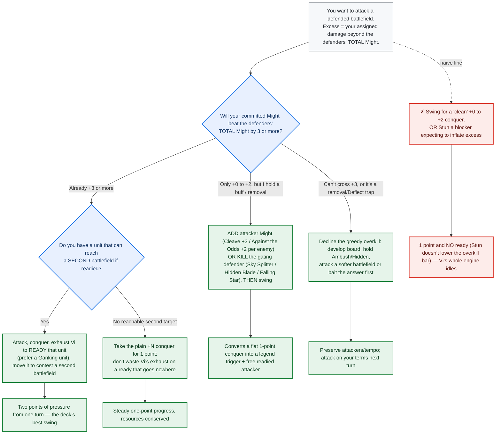

**Naive vs. expert.** *Naive:* swings for a tidy conquer at +0–+2 (one point, no ready),
or Stuns a wall expecting the excess to jump. *Expert:* does the arithmetic first, spends
a buff or a kill to cross +3, and readies a *reaching* unit — one turn, two battlefields.

### On the opponent's turn (defending) — *Win the Might math (there's no counter, and no defensive Stun)*

Vi is a **proactive race deck** — its "defense" is winning the defensive showdown's math,
not a control shell. It has **no counterspell**, and — critically — **Vi - Peacekeeper's
Stun is "when I *attack*"**, so Ambushing her on defense makes her a plain **Might-5
blocker**, not a stun. Over-defending is how this deck loses its tempo edge.

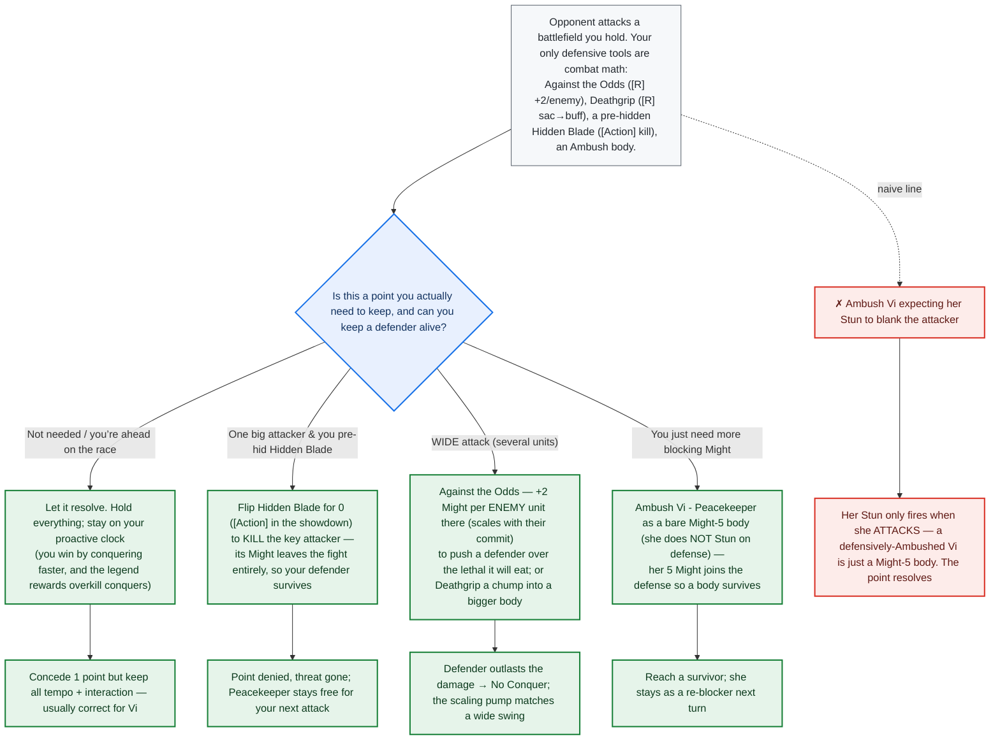

**Sources.** [Vi champion deck guide (riftboundguide.com, 2026-04-08)](https://riftboundguide.com/2026/04/08/riftbound-vi-champion-deck-guide/) ·
[How damage / excess works (riftboundguide.com)](https://riftboundguide.com/2026/03/29/how-damage-works-in-riftbound/) ·
[Combat rules (Rift Watcher)](https://riftwatcher.com/rules/combat/) ·
[Stun — deals no damage but still needs full lethal (Rift Watcher)](https://riftwatcher.com/rules/stun/) ·
[Ambush — pure play-timing, no stun on defense (Rift Watcher)](https://riftwatcher.com/rules/ambush/) ·
[Vi legend page — meta stats (Hextech Analytics)](https://hextechanalytics.com/legends/vi) ·
[Keyword glossary (runesandrift)](https://runesandrift.com/riftbound-keywords/).

---

## Azir — Emperor of the Sands
*(Calm / Order — Equipment-gated Sand Soldier swarm)*

**Game plan.** Azir's legend makes a 2-Might **Sand Soldier** token for 1 Energy — **only
if you've played an Equipment this turn** — and Sand Soldiers have **[Weaponmaster]** (they
can wear that Equipment, equipping for **1 Power less**, which is *free* for the 1-cost gear
the deck runs). So each turn: **play one cheap Equipment → make a Soldier → suit it up**,
building a go-wide board. The payoff is **Arise!** (a Soldier per Equipment you control,
ready up to two), which floods two battlefields at once for a double-conquer /
conquer-and-hold closing turn.

**Win condition.** 8 points via Conquer + Hold, using the token width to win showdowns at
**two** battlefields at once. Arise! + Azir - Sovereign's token-pull is the classic ~6→8
finisher (and satisfies the last-point rule by touching both boards the same turn).

**Power curve.** Strongest mid-game (T3–6): the equipment→legend loop makes a
Weaponmaster-buffed Soldier every turn, out-tempoing slower decks. Peak is the Arise! +
Sovereign flood. Weakest turn 1 (nothing to gate yet) and into **board wipes** — dumping
the whole board into a sweeper with no reload is how Azir loses winnable games.

| Card | What it does |
|---|---|
| **Azir - Emperor of the Sands** (Legend) | 1 Energy, exhaust → 2-Might Sand Soldier to base, **only if you played an Equipment this turn**. Grants your Sand Soldiers **[Weaponmaster]**. The gate is the whole deck's tempo. |
| **Arise!** (6 Energy + 1 Power, Signature) | Play a 2-Might Sand Soldier **per Equipment you control**, then **ready up to two**. With 4–6 gear out, an instant army — the finisher. |
| **Azir - Sovereign** (Might 4) | The closer: on attack, move **any number** of your token units to his battlefield to win that conquer, freeing width to contest a second. |
| **1-cost Equipment** (Doran's Shield · Eye of the Herald · Soul Sword) | The gate keys. Cheap [Equip] stat-fixers; playing **one per turn** keeps the engine live and gives Sand Soldiers something to wear for free via Weaponmaster. |
| **Guards!** / **Back Off** (Hidden) | Instant-speed plays: Guards! flips for 0 to make a Soldier (may pay Order to ready it); Back Off Stuns a unit (+draw from hand). Surprise defense / extra body. |
| **Discipline** (2 Energy, Reaction) | +2 Might **and draw 1** — the go-to showdown pump that also refuels an Equipment-hungry hand. |

> **The rule that anchors the whole deck:** [Weaponmaster]'s reminder text reads *"when
> they're played, you may [Equip] one of your Equipment to them for 🌈 less"* — i.e.
> **1 Power (one rune) cheaper**, which zeroes out the 1-cost gear the deck runs. And the
> legend's token only appears **if an Equipment was already played this turn** — so the
> order of operations (gear first, always) is not a preference, it's the engine.

### On your turn — *Play one Equipment first, every turn, to arm the gate*

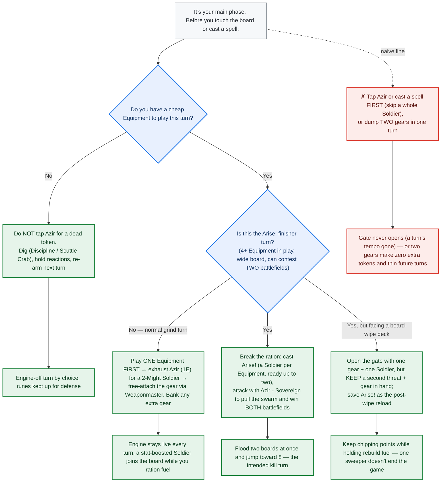

**Naive vs. expert.** *Naive:* taps Azir or casts a spell before playing gear (the gate
never opens, a Soldier lost — the deck's #1 tempo leak), or dumps two gears for zero extra
tokens. *Expert:* gear→legend→equip in that order every turn, rationing to one gear except
the Arise! turn, and holds rebuild fuel against sweepers.

### On the opponent's turn (defending) — *Keep one Sand Soldier alive; deny for free when the math holds*

Azir's swarm makes defense cheap: a Conquer needs the opponent to kill **every** defender
there, so **one surviving Sand Soldier cancels the point**. Spend a reaction only when the
incoming damage would wipe all your bodies — cheapest line first, and save answers for the
game-ending Conquer.

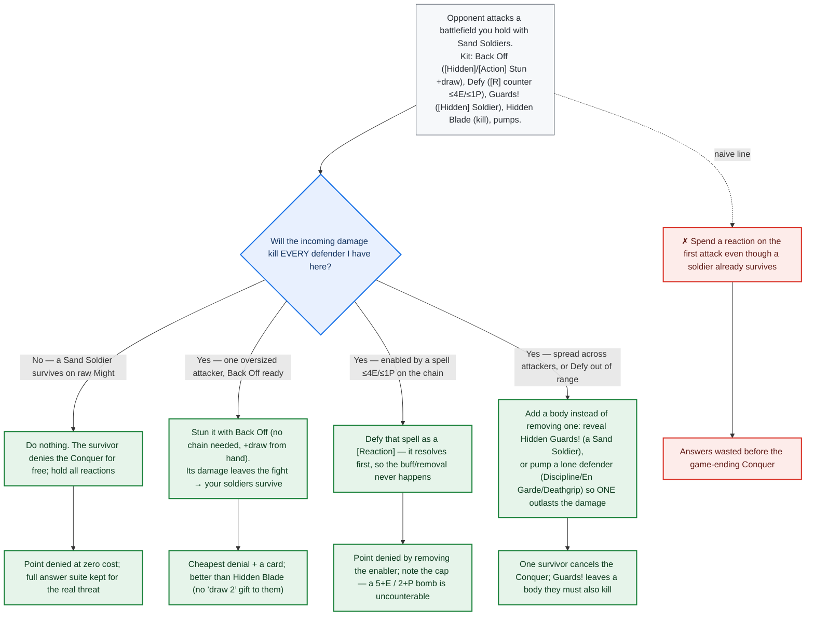

**Sources.** [Token Azir deck tech (Cards Realm)](https://riftbound.cardsrealm.com/en-us/articles/riftbound-deck-tech-token-azir) ·
[Weaponmaster — equip for 1 Power less (Rift Watcher)](https://riftwatcher.com/rules/keywords/weaponmaster/) ·
[Keyword glossary — Weaponmaster / Accelerate (learnriftbound.gg)](https://learnriftbound.gg/glossary) ·
[Spiritforged keyword rundown (runesandrift)](https://runesandrift.com/riftbound-spiritforged-keywords/) ·
[Spiritforged core rules / patch notes (official, playriftbound.com)](https://playriftbound.com/en-us/news/rules-and-releases/riftbound-core-rules-spiritforged-patch-notes/) ·
[Azir guide (riftbound.gg)](https://riftbound.gg/azir-emperor-of-the-sands-guide/) *(browser-reachable; bot-walls automated fetches)*.

*(The Weaponmaster reduction was confirmed as **1 Power less** by four independent sources; the featured Cards Realm list placed 2nd in group B at Ascension League stage 2 — the only tournament result found, no win-rate figures.)*

---

## Lillia — Bashful Bloom
*(Calm / Mind — [Temporary] Sprite tempo)*

**Game plan.** Flood **[Temporary]** Sprite tokens and use them as **use-it-now Conquer
tools**. A Temporary unit is killed at the start of your next Beginning Phase **before Hold
scoring** — so a Sprite can **Conquer** for an immediate point the turn it's made, but can
**never Hold**. Lillia's legend (4 Energy, exhaust → a **ready** 3-Might Temporary Sprite,
**−1 Energy per friendly Temporary unit**) plus Sprite Burst (two ready Sprites) generate
the pressure; you race to ~6–7 on Sprite conquers, then seal it with a **durable** unit.

**Win condition.** 8 points, mostly via **Conquer**. Crucially, your **Hold points and the
legal 8th point must come from non-Temporary units** (Fae Fawn, Watcher, Faefolk, Poro,
Student) — a Sprite left "to hold" evaporates before scoring. Thousand-Tailed Watcher
(ETB: all enemies −3 Might) softens both battlefields for a closing double-conquer.

**Power curve.** Strongest early-to-mid (T1–5): can pressure or conquer a battlefield as
early as turn one and snowball on relentless Sprite conquers. Weakest if the race stalls
(Sprites can never Hold and evaporate each upkeep) and into **Vex - Apathetic**, which
Stuns a Sprite *played onto its battlefield* — the deck's primary hard counter.

| Card | What it does |
|---|---|
| **Lillia - Bashful Bloom** (Legend) | 4 Energy, exhaust → a **ready** 3-Might **[Temporary]** Sprite; **−1 Energy per friendly [Temporary] unit**. Activate it **last** each turn so the discount is maxed. |
| **Sprite Burst** (5 Energy) | Two **ready** 3-Might Temporary Sprites at once — the enabler for conquering **both** battlefields in one turn. |
| **Lillia - Fae Fawn** (Might 3) | [Accelerate]. When she **moves** from a location, drop a 3-Might Temporary Sprite there — but that Sprite enters **exhausted** (it can't attack the turn it's made). |
| **Heart of Dark Ice** (gear) | Exhaust: **+3 Might** to a unit this turn — turns a 3-Might Sprite into a 6-Might attacker that actually breaks a blocker to Conquer. |
| **Thousand-Tailed Watcher** (Might 7) | Primary closer: [Accelerate], ETB **all enemies −3 Might** — deploy near 6 points to shrink both battlefields for a double-conquer. |
| **Unchecked Power** (7 Energy + 2 Power) | Reset: exhaust **all** friendly units, then **12 damage to ALL units at battlefields**. A *symmetric* wipe — fire it when the opponent's durable board out-values yours (you re-flood Sprites next turn; they don't). |

> **The correction that matters:** only the **legend's** and **Sprite Burst's** Sprites
> enter **ready** (their text says so). **Fae Fawn's** move-trigger Sprite enters
> **exhausted** — it holds/contests but can't attack the turn it appears.

### On your turn — *Conquer this turn, or nothing: how to spend each ready Sprite*

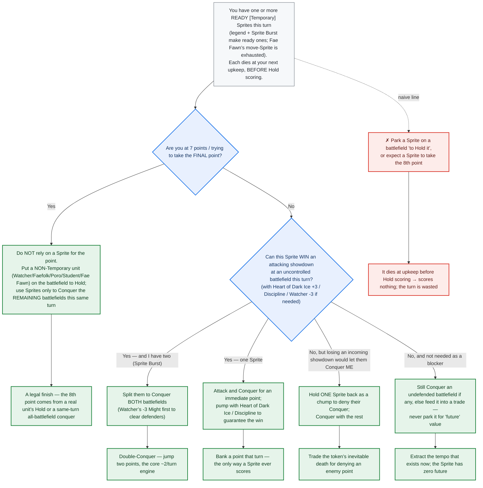

**Naive vs. expert.** *Naive:* parks Sprites "to hold a battlefield" (they vanish at
upkeep, scoring nothing) or expects a Sprite to take the last point. *Expert:* Conquers
with every ready Sprite the turn it exists (splitting Sprite Burst across both
battlefields), reserves a durable unit for the Hold and the 8th point, and fires Unchecked
Power only when the board favors the opponent.

### On the opponent's turn (defending) — *Chump with a dying-anyway Sprite*

Lillia's [Temporary] Sprites are **already dying** at your next upkeep, so blocking/trading
one to deny a Conquer costs **nothing** — the ideal defensive resource. Keep a survivor at
the battlefield (a No Result denies the point), spend a real card only when the free chump
won't cover it.

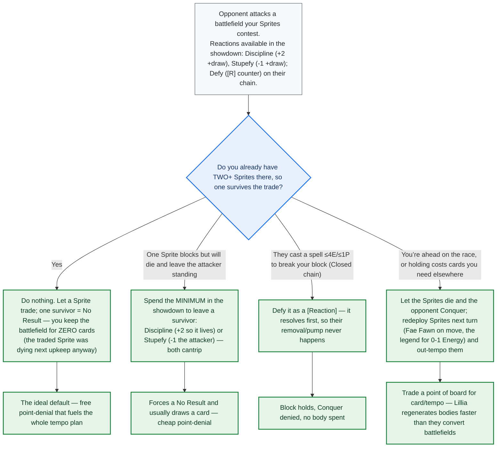

*(Unchecked Power — exhaust all friendly units + 12 to all battlefield units — is a
**your-main-phase** reset, not a reaction: fire it when they out-commit with big *real*
units, since your Sprites were dying anyway.)*

**Sources.** [Lillia aggro deck tech (Cards Realm, 2026-07-05)](https://riftbound.cardsrealm.com/en-us/articles/riftbound-deck-tech-lillia-aggro) ·
[Keyword glossary — [Temporary] reminder text (runesandrift)](https://runesandrift.com/riftbound-keywords/) ·
[Glossary — Temporary (Riftbound Wiki / Fextralife)](https://riftbound.wiki.fextralife.com/Glossary) ·
[Keywords — Temporary (riftboundguide.com)](https://riftboundguide.com/keywords/) ·
[Turn order & the scoring phase (runesandrift)](https://runesandrift.com/riftbound-turn-order/) ·
[Hold vs conquer ruling (RiftJudge #1297)](https://app.riftjudge.com/rulings/1297/how-does-scoring-work-in-riftbound-particularly-regarding-holding-and-conquering).

*(All three glossaries give the [Temporary] reminder — "killed at the start of its controller's Beginning Phase, **before scoring**" — and Cards Realm confirms Fae Fawn is "the only effect in the game that summons an **exhausted** Sprite token" and that Vex - Apathetic hard-counters the deck.)*

---

## Leona — Radiant Dawn
*(Calm / Order — stun-control midrange / buff accrual)*

**Game plan.** Leona is Origins' Calm/Order stun legend: *"When you stun one or more enemy
units, buff a friendly unit. (If it doesn't have a buff, it gets a +1 Might buff.)"* Read
what is **not** in that text: no exhaust, no once-per-turn — the trigger is free, so
**every separate stun event pays a buff**, on your turn or theirs (the "one or more" clause
only collapses a simultaneous multi-stun into a single buff). The shell is a defensive
Calm/Order midrange — Defy, Discipline, Sona - Harmonious, Shield/Tank bodies — whose
interaction is the **stun suite instead of removal**: each attack into a battlefield you
hold is answered by a 2–3 Energy stun that blanks the attacker's damage *and* permanently
grows your board. The community verdict (Cards Realm's "Holding Leona") matches the card
text: hold battlefields, frustrate every attack, and let the buffs compound until your
units simply win the math.

**Win condition.** 8 points, Hold-leaning: conquer early or open ground, then keep it —
every defended showdown banks a point at your next turn start *plus* a permanent +1.
**Zenith Blade** (stun + move a friendly unit to that battlefield) and **Leona -
Determined**'s attack-stun add conquers when their board is committed elsewhere. The
final-point rule never hurts a hold deck — the 8th point is naturally a Hold. And the
finisher is timed to the scoreboard: **Leona - Zealot enters ready once an opponent is
within 3 of the Victory Score** (score 5+), a deploy-and-fight Might 6 whose aura makes
late showdowns unwinnable for a stunned board.

**Power curve.** Weakest T1–2: with no board the legend is blank, and a stun is a card
spent to blank one attack. Mulligan for the cheap Calm starters — **Lonely Poro** (2E,
Might 2, Deathknell: draw 1 if it died alone), **Stellacorn Herder** (4E, Might 3, *when I
move, draw 1*), **Sona - Harmonious** (4E + 1 pip — end-of-turn readies up to 4 runes,
funding the pip-heavy stuns). Strongest anchored mid-game (~T3–6): one stun per enemy
attack ≈ a saved point plus a permanent +1, every cycle. Late, Zealot ready-deploys once
they hit 5 points and **Eclipse Herald** (7E + 1 pip, Might 7) re-readies with +1 Might on
every stun for multi-showdown turns. Weak to go-wide boards (a stun blanks one body),
removal-dense decks (Kai'Sa, Ezreal), and its own card flow (Back Off from hand and Grove
of the God-Willow patch it). **Meta reality:** a fringe archetype — Rift Watcher lists her
**Tier C, ~24.5% win rate, 0.7% play rate** (point-in-time, accessed 2026-07-10), and she
sits outside Hextech Analytics' ranked S–C tiers with no tracked top-8s in the events
surveyed. Treat any single percentage as a snapshot (see Sources).

| Card | What it does |
|---|---|
| **Leona - Radiant Dawn** (Legend) | Stun one-or-more enemy units → **buff a friendly unit**. No exhaust in the cost → fires on **every stun event**, both turns; a simultaneous multi-stun collapses to one buff. Buffs are **one per unit** — spread them; a second buff on the same unit doesn't apply. |
| **Leona - Determined** (4E + 1 pip, Might 4) | **[Shield]** (+1 while defending) and *when I attack, stun an enemy unit here* — the deck's one proactive stun: blanks the scariest damage-back mid-showdown and banks a buff. The stunned defender still takes **full lethal** — her stun is armor, not a kill. |
| **Leona - Zealot** (6E + 1 pip, Might 6) | The converter: **stunned enemy units here have −8 Might, min 1** — at her battlefield a stunned body up to Might 9 is a Might 1 that dies to anything. *Enters ready if an opponent's score is within 3 of the Victory Score* — the catch-up finisher fights the turn it lands. |
| **Rune Prison** (2E + 1 pip) / **Thwonk!** (2E, Repeat 2E) / **Back Off** (3E, [Hidden]) | The stun stack — all **[Action]s**, live in showdowns. Thwonk! targets **attackers only** (pure defense; Repeat stuns a second one). Back Off **from hand** draws 1; pre-hidden it flips for 0E, no draw. |
| **Zenith Blade** (3E + 2 pips, [Action]) | The signature: stun an enemy at a battlefield **and move a friendly unit there** — deliver Zealot onto the stunned unit, or turn a stun into a contest. A near-staple alongside Defy and Discipline. |
| **Solari Chief** (5E + 1 pip, Might 4) | ETB: choose an enemy — **if it's stunned, kill it**; otherwise stun it. With a stun cast first this is the colour pair's only on-demand kill; **Solari Shrine** (3E gear) exhausts to draw 1 whenever you kill a stunned unit. |
| **Fiora - Victorious** (4E, Might 4) | The premier buff target: one legend buff makes her **Mighty (5+)** → **Deflect, Ganking and Shield** all switch on. The buff currency, cashed as keywords. |

> **The correction that matters:** stun is **damage prevention, not removal.** A stunned
> attacker still stands at resolution and still conquers if all your defenders die, and a
> stunned defender still takes full lethal to clear. What Leona uniquely owns is the
> **converters**: Zealot's aura makes stunned enemies at her battlefield Might 1, and Solari
> Chief kills a stunned unit outright. Both are **same-turn** plays — stun wears off at end
> of turn (*"doesn't deal combat damage **this turn**"*), so a stun banked on their turn is
> gone by yours. Stun, then convert, in one turn — or accept that the stun bought one turn
> of silence plus one buff, nothing more.

### On your turn — *Convert the stun the turn you cast it — never stun just to farm a buff*

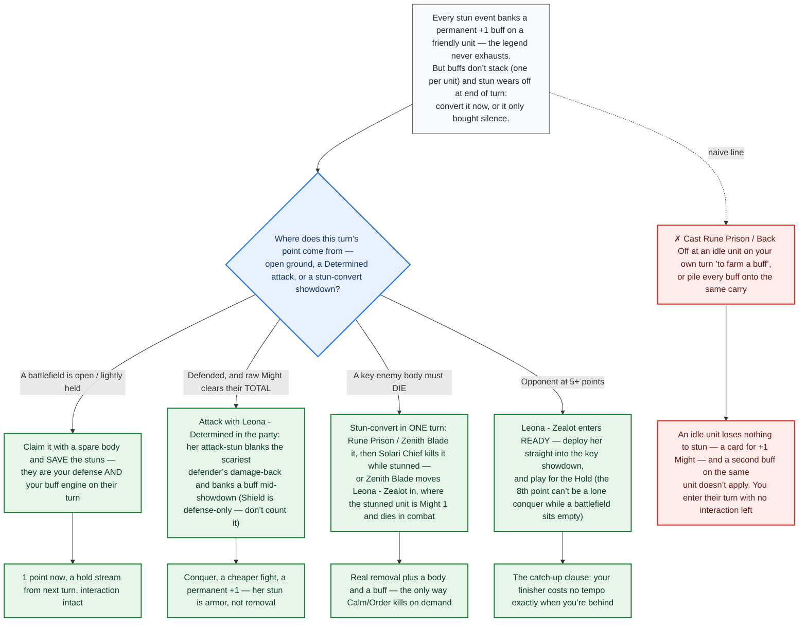

**Naive vs. expert.** *Naive:* treats stun as removal — stuns a wall and swings expecting
the conquer, reflex-stuns every showdown, farms buffs on its own turn, and stacks them on
one carry (they don't stack). *Expert:* spends stuns on the **opponent's** turn where a
blanked attacker is a saved point, converts stun into a kill **same-turn** via Zealot or
Solari Chief when the body must die, and spreads the buffs so the whole board creeps out of
everyone's combat math.

### On the opponent's turn (defending) — *Their attack is your engine turn: one stun, one survivor, one buff*

Unlike an exhaust-gated draw engine, Leona's legend has **no once-per-turn throttle** —
every enemy showdown you interact with compounds the board, which makes this tree the
deck's engine room. All three stuns are **[Action]s**, legal once you gain Focus in their
showdown; only **Defy** works in the Closed state against their spells; and a bare unit
played in Neutral Open can't be responded to at all.

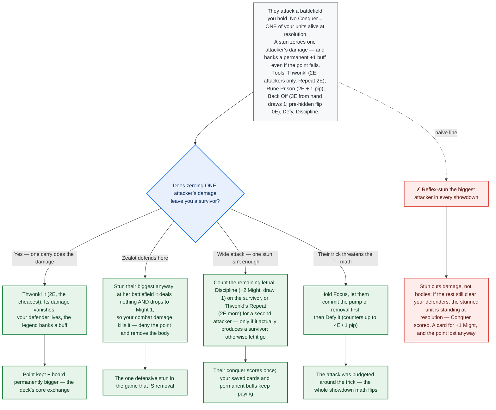

**Sources.** [Holding Leona deck tech (Cards Realm)](https://riftbound.cardsrealm.com/en-us/articles/riftbound-deck-tech-holding-leona) ·
[Stun — not removal, still needs full lethal (Rift Watcher)](https://riftwatcher.com/rules/stun/) ·
[Keyword glossary — Stun (runesandrift)](https://runesandrift.com/riftbound-keywords/) ·
[Stun ruling (RiftJudge)](https://app.riftjudge.com/questions) ·
[Leona legend page — Tier C / 24.5% WR / 0.7% play (Rift Watcher)](https://riftwatcher.com/legend/leona/) ·
[Tier list — sample & tiers (Hextech Analytics)](https://hextechanalytics.com/tierlist). Note: riftbound.gg's Leona guide
and some riftdecks / mobalytics RQ lists bot-wall automated fetches (403), and Hextech's per-legend Leona figures sit in a
collapsed row that couldn't be machine-read; canon on this deck is thin, so the trees above lean on engine-verified card
text more than tournament consensus.

---

## Web Resources & Sources

Community and official references used to build and cross-check these guides. Each was
checked during the 2026-07-10 pass; a handful of community sites bot-wall automated
requests (noted below) and were used via search-index summaries only.

### Rules & keywords (game-wide)
- **[RiftJudge #1297 — how scoring works (Conquer vs Hold)](https://app.riftjudge.com/rulings/1297/how-does-scoring-work-in-riftbound-particularly-regarding-holding-and-conquering)** — the authoritative ruling behind the "final point can't be a lone conquer" and Hold-timing lines.
- **[Combat rules (Rift Watcher)](https://riftwatcher.com/rules/combat/)** — damage assignment (lethal-to-one-before-the-next) and how "excess damage" is measured.
- **[How damage works in Riftbound (riftboundguide.com)](https://riftboundguide.com/2026/03/29/how-damage-works-in-riftbound/)** — excess/overkill arithmetic used by the Vi trees.
- **[Stun — deals no damage but still needs full lethal (Rift Watcher)](https://riftwatcher.com/rules/stun/)** and **[RiftJudge Q&A](https://app.riftjudge.com/questions)** — three-way confirmation that Stun is damage-prevention, **not** removal (the Vi and Leona corrections).
- **[Keyword glossary (runesandrift.com)](https://runesandrift.com/riftbound-keywords/)**, **[learnriftbound.gg glossary](https://learnriftbound.gg/glossary)**, **[Spiritforged keyword rundown (runesandrift)](https://runesandrift.com/riftbound-spiritforged-keywords/)**, **[Riftbound Wiki glossary (Fextralife)](https://riftbound.wiki.fextralife.com/Glossary)**, **[Rift Watcher — Weaponmaster](https://riftwatcher.com/rules/keywords/weaponmaster/)** / **[Ambush](https://riftwatcher.com/rules/ambush/)** — [Ambush], [Accelerate], [Weaponmaster] (= equip for 1 Power less), [Temporary] (killed before scoring), [Deathknell], [Shield], [Deflect].
- **[Turn order & the scoring phase (runesandrift)](https://runesandrift.com/riftbound-turn-order/)** — places Hold scoring inside the Beginning Phase, after [Temporary] units die.
- **[Spiritforged core rules / patch notes (official, playriftbound.com)](https://playriftbound.com/en-us/news/rules-and-releases/riftbound-core-rules-spiritforged-patch-notes/)** — official Weaponmaster / triggered-ability rulings.
- **[Vex - Apathetic ruling (riftboundfaq.com)](https://www.riftboundfaq.com/cards/vex-apathetic)** — confirms the auto-selected stun is not a "target" (targeting protection can't stop it).

### Per-legend
- **Diana:** [RQ-Vancouver champion deck guide (riftboundguide.com)](https://riftboundguide.com/2026/06/08/riftbound-diana-champion-deck-guide/) · [Diana legend page — text, tier, results (Hextech Analytics)](https://hextechanalytics.com/legends/diana) · [Diana tempo / counter matchup (RiftStorm.gg)](https://riftstorm.gg/blog/diana-counter-riftbound-tempo)
- **Vi:** [Vi champion deck guide (riftboundguide.com)](https://riftboundguide.com/2026/04/08/riftbound-vi-champion-deck-guide/) · [Vi legend page — meta stats (Hextech Analytics)](https://hextechanalytics.com/legends/vi)
- **Azir:** [Token Azir deck tech (Cards Realm)](https://riftbound.cardsrealm.com/en-us/articles/riftbound-deck-tech-token-azir) · [Azir guide (riftbound.gg)](https://riftbound.gg/azir-emperor-of-the-sands-guide/) *(browser-only)* · [Calm/Order Azir deck guide (Rift Mana)](https://riftmana.com/calm-order-azir-emperor-of-the-sands-deck-guide/) *(browser-only)*
- **Lillia:** [Lillia aggro deck tech (Cards Realm)](https://riftbound.cardsrealm.com/en-us/articles/riftbound-deck-tech-lillia-aggro) · [Lillia guide (riftbound.gg)](https://riftbound.gg/lillia-bashful-bloom-guide/) *(browser-only)*
- **Leona:** [Holding Leona deck tech (Cards Realm)](https://riftbound.cardsrealm.com/en-us/articles/riftbound-deck-tech-holding-leona) · [Leona legend page — Tier C / 24.5% WR / 0.7% play (Rift Watcher)](https://riftwatcher.com/legend/leona/) · [Tier list (Hextech Analytics)](https://hextechanalytics.com/tierlist)

> **Bot-walls.** Several community sites (riftbound.gg, mobalytics.gg, riftmana.com, riftdecks.com) return HTTP 403 to
> automated fetches but load normally in a browser — links marked *(browser-only)* are still useful to a human reader;
> they simply couldn't be machine-verified in the 2026-07-10 pass.

### Engine-verified card data
- All card **rules text, Energy/Power costs, and Might** in this document were re-verified against the project's distilled `data/card_behavior.json` — the exact lowercased tokens the game engine pattern-matches — and each keyword against its printed reminder text. Where a community source and the card text disagreed, **the card text wins.**

> **A note on numbers.** Public "tier," "win rate," and "meta share" figures for these
> archetypes come from third-party trackers that update frequently and disagree with each
> other; treat any specific percentage as a snapshot, not a constant. The strategic lines
> in the decision trees are derived from card text and rules and do not depend on those
> numbers.
